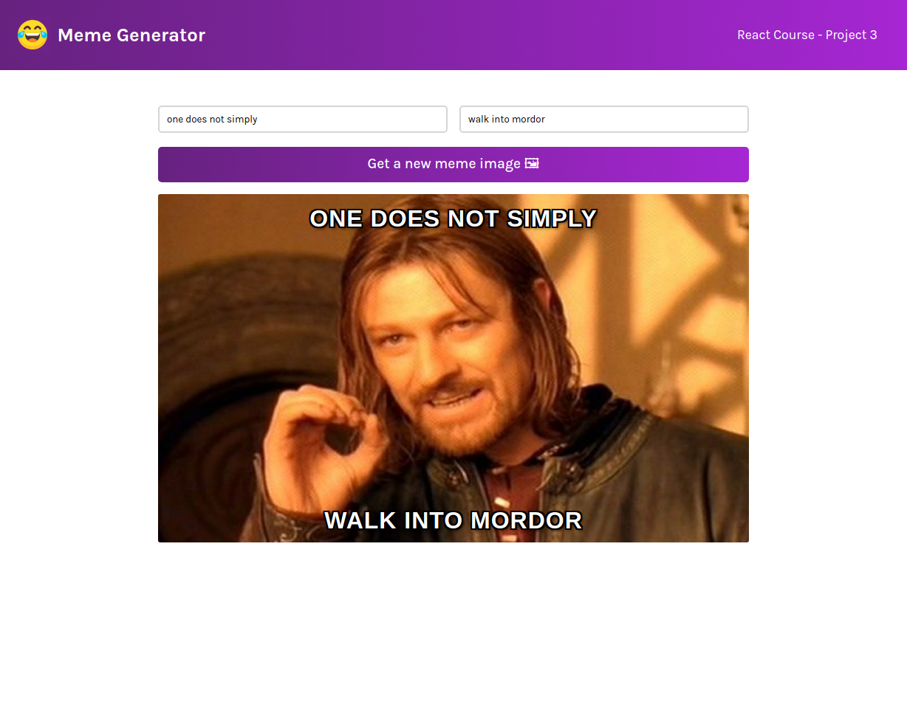
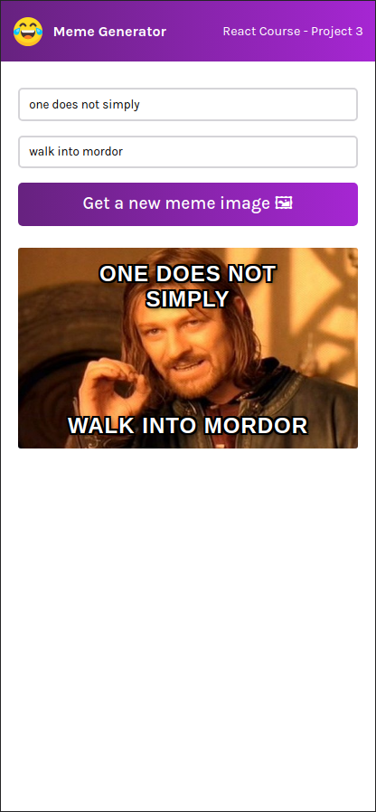

# Scrimba React Project #5: Meme generator

The goal of this Scrimba project was to create a meme generator using React and Imgflip API.

I started and finished this project in May 2023.

## Assignment

[Scrimba - Learn React - #5 Meme generator](https://scrimba.com/learn/learnreact)

## Technology

- React
- JavaScript
- Vite
- CSS

## Key Concepts

- State: useState, changing state, updating state objects and arrays
- useEffect: side effects, syntax, dependencies array, async functions
- Forms in React: inputs and submitting the form
- Event listeners in React
- Conditional rendering: && and ternary operator ? :
- Fetching data from API

## Features

- The API gives an array of 100 most popular memes
- Get a random meme from the array
- Add top text and bottom text

## Links

[Live Demo](https://brightneon7631.github.io/scrimba-meme-generator/)

[My Other Projects](https://brightneon7631.github.io/odin-scrimba-projects/)

## Screenshots

### Desktop



### Mobile



## Sources

- <a href="https://www.flaticon.com/free-icons/laugh" title="laugh icons">Laugh icons created by NajmunNahar - Flaticon</a>
- https://fonts.google.com/specimen/Karla

## Deployment

```bash
# clone repo
git clone

# install project dependencies
npm install

# run vite dev server
npm run dev

# create a production build
npm run build
```
